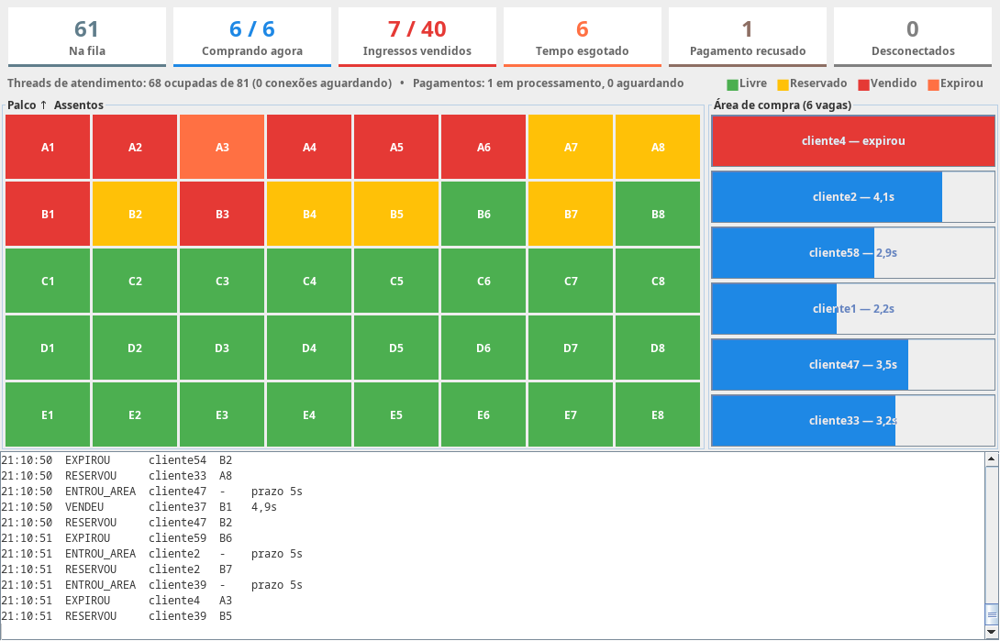
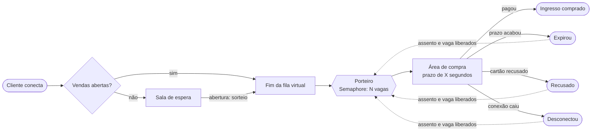
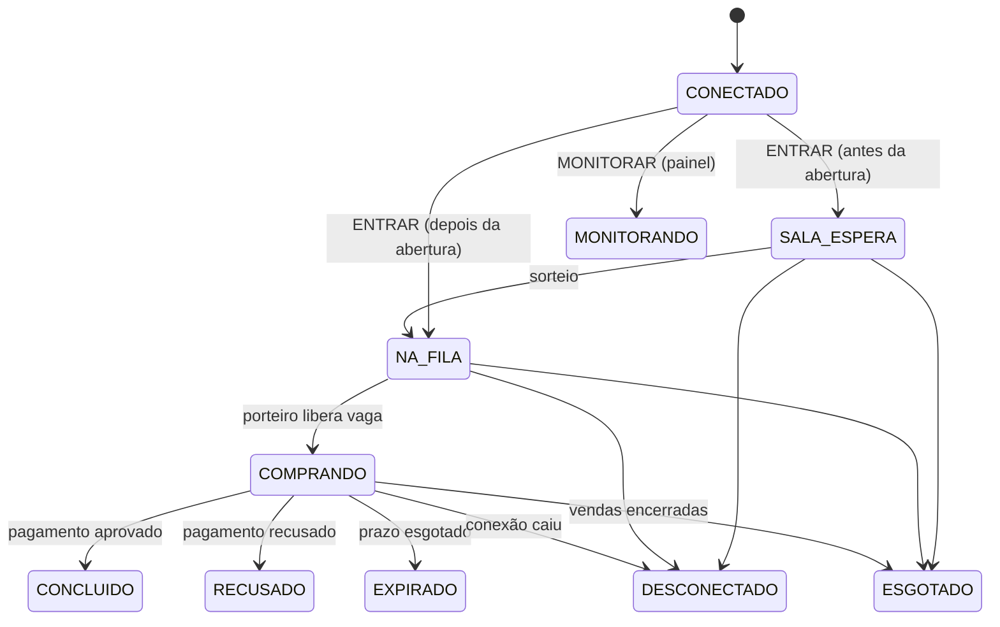
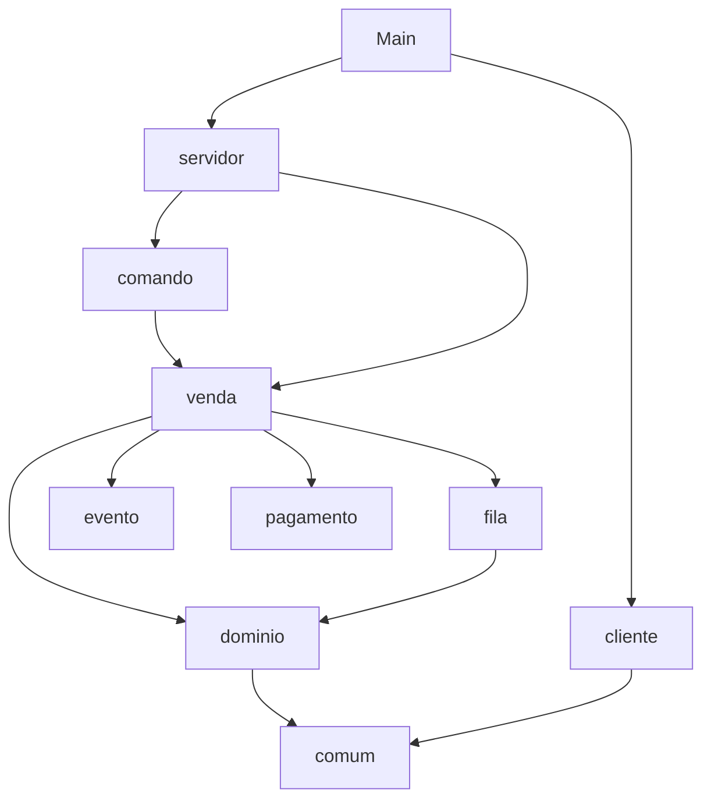
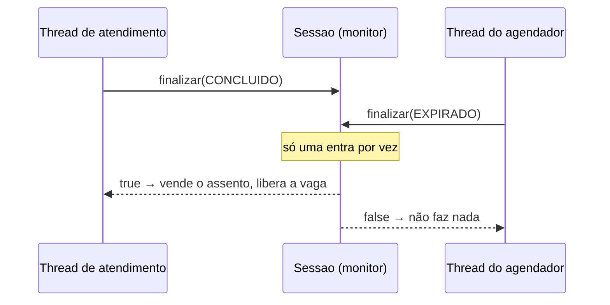

# 🎫 CompraIngresso — Venda de Ingressos com Fila Virtual

Simulação de uma venda de ingressos de show no estilo Ticketmaster/Eventim, feita em Java para a disciplina de **Programação Concorrente e Paralela**.

Centenas de clientes se conectam ao servidor ao mesmo tempo, esperam numa **sala de espera**, passam por um **sorteio**, entram numa **fila virtual** e só um número limitado deles pode comprar por vez. Cada um tem um **prazo** para escolher o assento e pagar; quem não consegue perde a vez e libera o lugar para o próximo. Tudo acontece em tempo real e aparece num **painel animado**.

O projeto tem três pilares:

- **Framework Executor** — pools de threads para atendimento, pagamento, agendamento e clientes simulados.
- **Sockets** — toda a comunicação cliente/servidor é por TCP, com um protocolo de texto próprio.
- **Concorrência** — `Semaphore`, `ReentrantLock`, `synchronized`, `wait/notifyAll`, `ArrayBlockingQueue` e tarefas agendadas trabalhando juntos.



---

## Sumário

- [Como executar](#como-executar)
- [Como funciona a venda](#como-funciona-a-venda)
- [Arquitetura](#arquitetura)
- [Concorrência: onde cada recurso é usado](#concorrência-onde-cada-recurso-é-usado)
- [Padrões de projeto](#padrões-de-projeto)
- [Princípios SOLID](#princípios-solid)
- [Protocolo de mensagens](#protocolo-de-mensagens)
- [Configuração](#configuração)
- [Casos de borda tratados](#casos-de-borda-tratados)

---

## Como executar

Requisitos: **Java 21+** (sem dependências externas).

### Pelo IntelliJ

Abra o projeto, abra `src/ingressos/Main.java` e clique em **Run**. Sobe tudo de uma vez: servidor, painel e clientes simulados.

### Pelo terminal

```bash
javac -d out $(find src -name '*.java')
java -cp out ingressos.Main
```

### Partes separadas (vários terminais ou máquinas)

```bash
java -cp out ingressos.Main servidor   # só o servidor
java -cp out ingressos.Main painel     # só o painel de monitoramento
java -cp out ingressos.Main clientes   # só os clientes simulados
```

Também é possível comprar "na mão" conectando com `nc localhost 5000` e digitando os comandos do [protocolo](#protocolo-de-mensagens):

```text
ENTRAR maria 12345678900
SALA_ESPERA
POSICAO 3
SUA_VEZ 8
LISTAR
MAPA A1:L A2:V A3:L ...
RESERVAR A1
RESERVADO A1
PAGAR
COMPRA_OK A1
```

Ao final o servidor imprime um relatório:

```text
============ RELATÓRIO FINAL ============
Clientes ................. 80
Rejeitados (LOTADO) ...... 0
Ingressos vendidos ....... 40 de 40
Expirados ................ 24
Pagamentos recusados ..... 8
Desconectados ............ 0
Sem ingresso (esgotado) .. 8
Desfechos / clientes ..... 80 / 80 (ok)
=========================================
```

A linha **Desfechos / clientes** confere que cada cliente terminou exatamente uma vez — nenhum se perdeu e nenhum foi contado duas vezes.

---

## Como funciona a venda



1. **Sala de espera e sorteio** — quem conecta antes da abertura espera numa sala. Na abertura (agendada), a ordem é **sorteada** e todos vão para a fila. Quem chega depois entra no fim da fila.
2. **Área de compra limitada** — o **Porteiro** só deixa entrar `N` clientes por vez (as vagas de um `Semaphore`). Os demais esperam na fila.
3. **Prazo** — ao entrar na área de compra, o cliente tem um prazo fixo para listar os assentos, reservar e pagar.
4. **Tempo humano aleatório** — cada cliente simulado sorteia quanto tempo "demora para preencher os dados". O servidor não sabe esse tempo; ele só faz valer o prazo.
5. **Pagamento com recusa** — o pagamento roda num pool próprio, demora um pouco e pode ser recusado. Recusa ou prazo esgotado devolvem o **assento** e a **vaga**, chamando o próximo da fila.
6. **Fim** — quando todos os assentos são vendidos (ou acaba o tempo máximo), quem ainda espera recebe `ESGOTADO` e o servidor encerra os pools e imprime o relatório.

### Ciclo de vida da sessão (padrão State)



Cada estado define quais comandos aceita — `RESERVAR` só é válido em `COMPRANDO`, por exemplo. Qualquer outro recebe `ERRO`.

---

## Arquitetura

Três programas que conversam por socket (podem rodar na mesma JVM pelo `Main` ou separados):

| Programa | Papel |
|---|---|
| **Servidor** | aceita conexões, controla sala de espera, fila, vagas, assentos, prazos e pagamentos |
| **Clientes simulados** | centenas de compradores disparados por um `ExecutorService`, em duas ondas (antes e depois da abertura) |
| **Painel** | interface Swing que se conecta com `MONITORAR` e mostra tudo ao vivo |

### Pacotes

```
src/ingressos/
├── Main.java                     ponto de entrada (tudo junto ou cada parte separada)
├── comum/                        usado por servidor e clientes
│   ├── Config                    lê o ingressos.properties
│   ├── Mensagem                  mensagem do protocolo (record + enum de tipos)
│   ├── Conexao                   socket com leitura/escrita por linha
│   └── FabricaThreads            dá nome e prioridade às threads dos pools
├── servidor/
│   ├── Servidor                  monta tudo, executores, laço accept() e desligamento
│   ├── Atendimento               uma tarefa do pool por conexão
│   ├── comando/                  Comando, ComandoFactory
│   ├── dominio/                  Assentos, Sessao, AreaCompra, RegistroCpf
│   ├── fila/                     FilaVirtual, Porteiro, PoliticaFila
│   ├── pagamento/                GatewayPagamento, PagamentoSimulado
│   ├── evento/                   Evento, Observador, Notificador, Estatisticas
│   └── venda/                    Bilheteria (casos de uso)
└── cliente/
    ├── ClienteSimulado           comprador automático
    ├── SimuladorClientes         dispara os clientes em ondas
    └── painel/                   PainelMonitor, CabecalhoPainel, GradeAssentos, PainelGuiches
```

As dependências seguem uma única direção, sem ciclos:



### Executores do servidor

| Executor | Tipo | Para quê |
|---|---|---|
| `poolAtendimento` | `ThreadPoolExecutor` fixo + `ArrayBlockingQueue` limitada | uma tarefa por conexão; se lotar, responde `LOTADO` (política de rejeição) |
| `poolPagamento` | `Executors.newFixedThreadPool` | processa os pagamentos (`submit` + `Future`) |
| `agendador` | `ScheduledThreadPoolExecutor` | abre as vendas, encerra por tempo máximo, controla o prazo de cada cliente e publica o status a cada 1 s |
| `porteiro` | `Executors.newSingleThreadExecutor` (prioridade máxima) | chama o próximo da fila sempre que vaga um guichê |

No lado cliente, o `SimuladorClientes` usa um `newFixedThreadPool` e coleta o desfecho de cada cliente via `Future<String>`. O desligamento usa `shutdown`, `awaitTermination` e `shutdownNow`.

---

## Concorrência: onde cada recurso é usado

| Recurso | Onde | Por quê |
|---|---|---|
| `ServerSocket` / `Socket` | `Servidor`, `Conexao` | comunicação TCP cliente/servidor |
| `ThreadPoolExecutor` | `Servidor` | atender muitas conexões reaproveitando threads |
| `ScheduledExecutorService` | `Servidor`, `Bilheteria` | abertura das vendas, prazo de compra, status periódico |
| `Future` / `Callable` | `PagamentoSimulado`, `SimuladorClientes` | obter o resultado de tarefas executadas no pool |
| `Semaphore` | `AreaCompra` | limitar quantos clientes compram ao mesmo tempo |
| `ArrayBlockingQueue` | `FilaVirtual`, `poolAtendimento` | fila virtual e fila de tarefas do executor |
| `ReentrantLock` | `Assentos` | impedir que dois clientes reservem o mesmo assento |
| `synchronized` | `Sessao`, `FilaVirtual`, `RegistroCpf`, `Conexao` | transições de estado atômicas, CPF único, envio seguro pelo socket |
| `wait` / `notifyAll` | `FilaVirtual` | o porteiro dorme até a abertura das vendas |
| prioridade de thread | `FabricaThreads` | porteiro com `MAX_PRIORITY` |
| `sleep` | `ClienteSimulado`, `PagamentoSimulado` | tempo humano e latência da operadora |
| `join` | `Main`, `PainelMonitor` | esperar o servidor e a thread leitora do painel |
| `Atomic*` | `Sessao`, `Estatisticas`, `FabricaThreads` | contadores e ids sem bloqueio |
| `SwingUtilities.invokeLater` | `PainelMonitor` | atualizar a interface só na thread da interface (EDT) |

### A disputa mais importante: pagar × prazo esgotado

Duas threads podem tentar encerrar a mesma compra ao mesmo tempo: a de atendimento (o cliente pagou) e a do agendador (o prazo acabou). As duas chamam `Sessao.finalizar`, que é `synchronized` e só age se a sessão ainda estiver em `COMPRANDO`:



Quem chega primeiro vence. Assim a vaga do `Semaphore` é liberada **exatamente uma vez** e o assento nunca fica vendido e expirado ao mesmo tempo.

---

## Padrões de projeto

| Padrão | Onde | Para quê |
|---|---|---|
| **Command** | `Comando` | cada mensagem do cliente vira uma ação isolada |
| **Factory** | `ComandoFactory` | cria o comando a partir do tipo da mensagem |
| **State** | `Sessao.Estado` | cada estado da sessão define os comandos aceitos |
| **Strategy** | `PoliticaFila` (`SORTEIO`, `FIFO`) | troca a regra de ordenação da fila pela configuração |
| **Observer** | `Notificador` → `Estatisticas`, log do console, painéis | quem gera o evento não conhece quem o consome |

---

## Princípios SOLID

| Princípio | Como aparece |
|---|---|
| **S** — Responsabilidade única | cada classe faz uma coisa: `FilaVirtual` cuida da fila, `Porteiro` libera vagas, `RegistroCpf` controla CPFs, `Estatisticas` conta, `Bilheteria` só orquestra os casos de uso; no painel, cabeçalho, grade e guichês são componentes separados |
| **O** — Aberto/fechado | novos comandos entram por `ComandoFactory.registrar(...)` e novos interessados em eventos por `Notificador.adicionar(...)`, sem alterar quem já existe |
| **L** — Substituição de Liskov | qualquer implementação de `Observador`, `GatewayPagamento` ou `Comando` pode ser usada no lugar de outra |
| **I** — Segregação de interfaces | interfaces pequenas, de um método: `Observador`, `GatewayPagamento`, `Comando` |
| **D** — Inversão de dependência | a `Bilheteria` recebe tudo pelo construtor e depende de `GatewayPagamento`, não da simulação; o `Servidor` é o único lugar que monta as peças |

---

## Protocolo de mensagens

Texto puro, uma mensagem por linha: `TIPO arg1 arg2 ...`.

| Cliente → Servidor | Respostas possíveis |
|---|---|
| `ENTRAR <nome> <cpf>` | `SALA_ESPERA` · `POSICAO <k>` · `CPF_EM_USO` · `ESGOTADO` |
| `LISTAR` | `MAPA A1:L A2:R A3:V ...` (L = livre, R = reservado, V = vendido) |
| `RESERVAR <assento>` | `RESERVADO <assento>` · `INDISPONIVEL <assento>` |
| `PAGAR` | `COMPRA_OK <assento>` · `PAGAMENTO_RECUSADO` · `TEMPO_ESGOTADO` |
| `SAIR` | `ATE_LOGO` |
| `MONITORAR` | `CONFIG <linhas> <colunas> <vagas> <prazo>`, `MAPA ...` e um fluxo de `EVT ...` |
| comando inválido no estado atual | `ERRO <motivo>` |

Mensagens que o servidor envia **sem pedido** (a qualquer momento): `POSICAO <k>`, `SUA_VEZ <prazo>`, `TEMPO_ESGOTADO`, `ESGOTADO`, `LOTADO`.

Eventos do painel (`EVT <tipo> <cliente> <assento> <detalhe>`): `ENTROU`, `SORTEIO`, `ENTROU_AREA`, `RESERVOU`, `VENDEU`, `EXPIROU`, `RECUSADO`, `DESCONECTOU`, `ESGOTADO`, `REJEITADO`, `ENCERRADO`, `STATUS`, `MAPA`.

---

## Configuração

Tudo fica em `ingressos.properties`, na raiz do projeto. Chaves ausentes usam o valor padrão.

| Chave | Padrão | Significado |
|---|---|---|
| `host` / `porta` | `localhost` / `5000` | endereço do servidor |
| `linhas` / `colunas` | `10` / `10` | tamanho da plateia (100 assentos) |
| `vagasAreaCompra` | `5` | clientes comprando ao mesmo tempo (permissões do `Semaphore`) |
| `prazoCompraSeg` | `8` | prazo para concluir a compra |
| `atrasoAberturaSeg` | `10` | segundos até abrir as vendas |
| `duracaoMaximaSeg` | `600` | encerra as vendas mesmo sem esgotar |
| `politicaFila` | `SORTEIO` | `SORTEIO` ou `FIFO` |
| `sementeSorteio` | vazio | fixa o sorteio (útil para repetir um experimento) |
| `probRecusaPagamento` | `0.1` | chance de o cartão ser recusado |
| `latenciaPagamentoMinMs` / `MaxMs` | `300` / `1200` | demora da operadora |
| `threadsAtendimento` / `filaAtendimento` | `250` / `50` | tamanho do pool de atendimento e da sua fila |
| `threadsPagamento` | `3` | threads do pool de pagamento |
| `numClientes` | `200` | clientes simulados |
| `clientesPrimeiraOnda` | `150` | quantos chegam antes da abertura |
| `intervaloOndasSeg` | `12` | intervalo até a segunda onda |
| `tempoHumanoMinSeg` / `MaxSeg` | `2` / `11` | faixa do tempo de preenchimento de cada cliente |

Experimentos interessantes: mudar `vagasAreaCompra` (3 × 10), trocar `SORTEIO` por `FIFO`, diminuir `prazoCompraSeg` ou reduzir `threadsAtendimento` para ver clientes recebendo `LOTADO`.

---

## Casos de borda tratados

- **Cliente chega no exato instante do sorteio** — a entrada na sala e a abertura usam o mesmo monitor, então ninguém fica perdido fora da fila.
- **Conexão cai no meio da compra** — o `finally` do atendimento devolve o assento, a vaga e o CPF.
- **Cliente sai da fila antes da vez** — se o porteiro já o tinha retirado da fila, a vaga é devolvida.
- **Pagamento termina depois do prazo** — o prazo vence a disputa e o cliente recebe `TEMPO_ESGOTADO`.
- **Mesmo CPF em duas conexões** — a segunda recebe `CPF_EM_USO` (regra anti-cambista).
- **Pool de atendimento lotado** — a política de rejeição responde `LOTADO` e fecha a conexão.
- **Encerramento limpo** — sockets são fechados para destravar as threads paradas em leitura, e os pools são desligados com `shutdown`/`awaitTermination`.
- **Exceções em tarefas agendadas** — são exibidas no console em vez de sumirem em silêncio.
